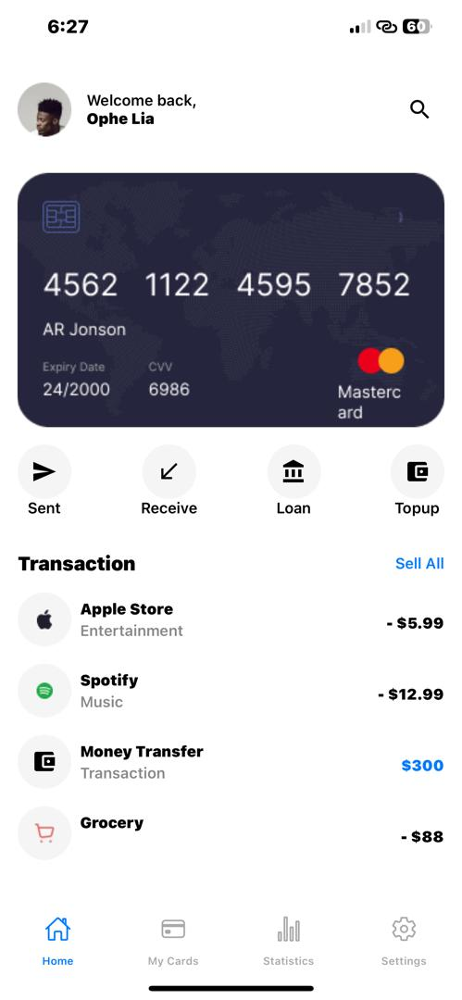
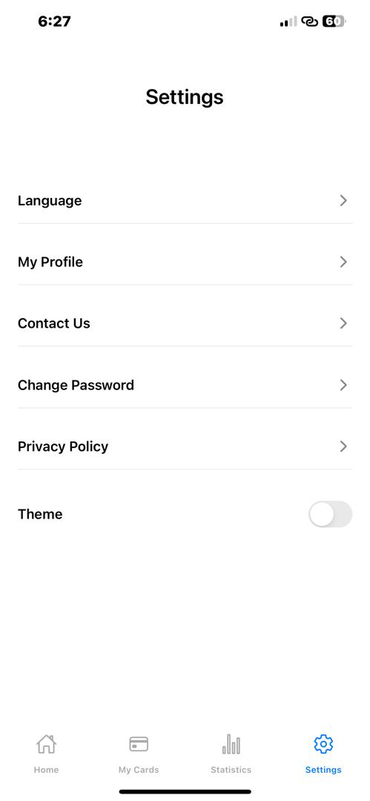
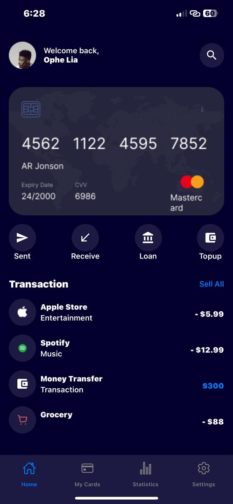
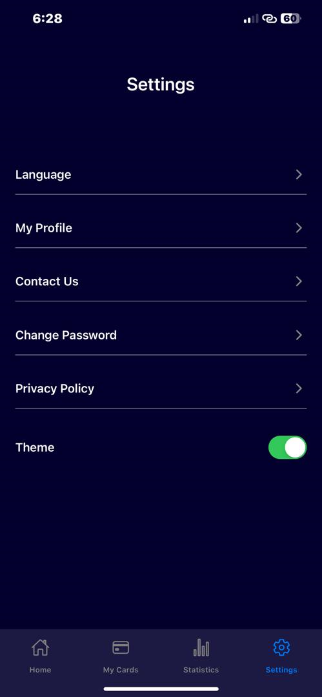

# rn-assignment5-11115960
## OVERVIEW
 In this project, the goal was to create an interface that uses React Navigation to create a bottom tab navigator with multiple screens. It includes a theme button to switch between light and dark modes.
## INSTALLED DEPENDENCIES
The following are the installed dependencies:
- @react-navigation/native: It provides the NavigationContainer component which is necessary for wrapping your entire navigation structure.
- @react-navigation/bottom-tabs: The library allows for the creation of a bottom tab navigator using createBottomTabNavigator. 
- @react-navigation/stack: The library allows for the creation of a stack navigator using createStackNavigator which is used for creating a stack-based navigation structure, where screens can be pushed onto or popped off the stack
## COMPONENTS:
**App.js**
The main entry point of the application.
Configures the navigation structure and theme context.
Uses react-navigation to create bottom tab navigation and stack navigation.
**Homepage.js**
  This is the component for the homepage screen. It makes use of the following UI components:
  - ScrollView makes vertically scrolling through content possible.
  - SafeAreaView ensures that the content renders within safe area bounds.
  - FlatList renders lists with optimized performance.
  - TouchableOpacity: Allows tapping on interactive elements like the buttons.
  - Various styles for layout, text, and image styling.
  
**Mycards.js**
This is the component for the My Cards screen.
**Settingpage.js**
Setttingpage.js is the component for the settings screen.
In addition to all the UI components employed in the homepage.js the switch component was also introduced in settingpage.js to toggle between dark and light modes. This was impleme
**Statistics.js**
This is the component for the statistics screen.
## NAVIGATION
The bottom tab navigator includes tabs for Home, My Cards, Statistics, and Settings.
Stack Navigator: Each tab has its own stack navigator for handling nested navigation.
## SCREENSHOTS

